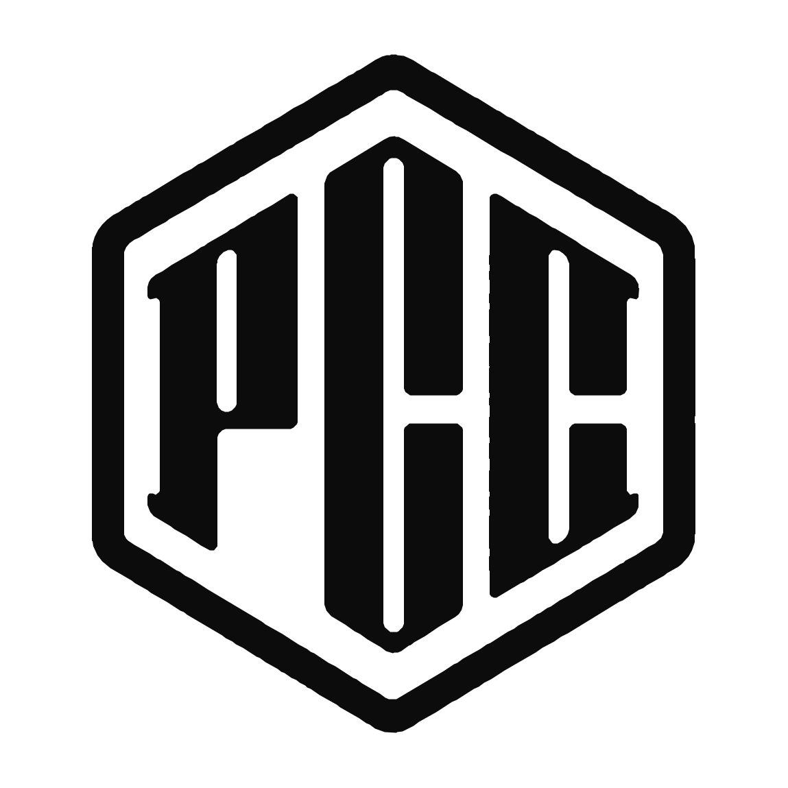

<picture>
  <source media="(prefers-color-scheme: dark)" srcset="./assets/pcc-logo-for-dark.svg">
  <source media="(prefers-color-scheme: light)" srcset="./assets/pcc-logo-for-light.svg">
  
</picture>

# Physical Control Center Inc.

Physical Control Center Inc. supports athletes and teams through food, nutrition, and data-informed practices focused on physical development and health.

For more about PCC, visit [clubhouse-meal.com](https://clubhouse-meal.com/).

## PCC IT Department

The PCC IT Department develops digital operations and technology capabilities to support PCC and the people and teams we serve.

Our work focuses on:

- **Build PCC's IT function** — Improve operations through software, data, and connected devices, reducing the burden on frontline teams while building durable IT capabilities across the company.
- **Support athletes and their communities** — Provide products and data-driven insights that help athletes and their communities develop their physical capabilities, confidence, and health.
- **Carry knowledge forward** — Turn the knowledge, experience, and outcomes gained through our work into value for future athletes and the broader field.

---

PHYSICAL CONTROL CENTER INC.
